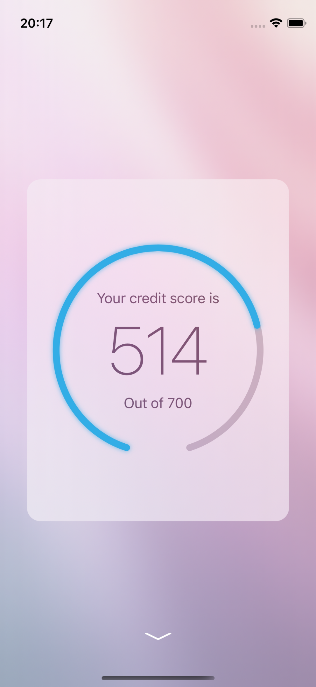

#  ClearScore Assessment

By Luke Van In.

Simple demonstration app which displays credit rating information loaded from a web service. 



Some features which this sample demonstrates:
- Model-View-Controller design pattern, using Combine publishers.
- Finite State Machine design pattern. 
- Composite builder pattern to create flexible view controller hierarchy.
- Type-safe and reusable networking component for loading and deserializing JSON content from a remote web service.
- Convenient expression syntax for composing autolayout constraints.

## Notes:

- Tests have implemented as an example of how the design facilitates testing, however tests still need to be 
implemented for some components, namely builders and view controllers.

## Design:

This app makes use of the standard `Model-View-Controller` design pattern or "architecture" used by UIKit. The 
components adhere to the following conventions:

- `Views` display information on the screen. They should be as simple as possible and do not contain any business logic 
or own any data. They do not depend on any other components. Views are updated by ViewControllers. Views communicate 
with view controllers by sending messages, usually through the use of target-actions, delegate callbacks, or closure. 
Some custom views are used for displaying circular progress indicators, playing videos, and other use cases.    

- `ViewControllers` serve the purpose of mediating between the models. They observe models and update the view, and 
receive events from views and delegate actions. In this app, view controllers generally define a `ViewModel` which
encapsulates all of the data that is presented on the view, in a form that can be displayed without extra processing.
It is the responsibility of the builder to convert the data from the model into the view model for the view controller.
In some cases view controllers need to perform actions on behalf of the view. These actions are implemented as closures
which the builder passes to the view controller.

- `Models` are the single source of truth of all information handled by the app. Models fetch data from a an external 
source such a repository, convert the data into an internally defined canonical form, and publish the information to
be transformed and used by by observers. In this app the model data is consumed by view controllers which observe
the model, convert the model information into a form that can be displayed, and then pass that information to a view
to be displayed.

These are the primary components of the user interface. Other common types of components are used:

- `Environment` contains dependencies used by view controllers, such as the `ScoreModel` which has the user's credit 
score information.

- `Builders` encapsulate constructing classes of objects. This app uses two types of builders: 
1. Environment builders create environment objects for different runtime scenarios, such as testing and production.
2. Module builder create view controllers and their dependencies.

- `Repositories` provide access to raw data from an external service provider, such as a web service or database. In 
this app the `ScoreWebRepository` fetches score data from the backend. Repositories are often used to provide data 
to models.  

- `Transformers` convert one type of data to another, such as converting a model into a view model. Encapsulating 
the process allows for the conversion to be tested independently of its use case. 

Code is organised into folders according to its function. 

`/App`: Contains the standard `AppDelegate` and `SceneDelegate`. The `Environment` class acts as a service locator or
registry, and is used for passing global dependencies between builders. 

`/Protocols`: Defines global protocols which are used throughout the app, including the protocol for module builders, 
and the interface for the repository. The repository should usually be defined in a separate framework or 
package, independently of the main application source code, for better maintainability.

`/Builder`: Contains implementations for builders. There are two sub-folders, for environment builders and 
module builders.

`/ViewController`: View controllers for modules and components.

`/View`: Custom views used by view controllers. 

`/Model`: Contains complex models such as the `ApplicationConfiguration` and `ScoreModel`, as well as simple canonical 
data types for representing values such as `Percentage` and `Currency`.     

`/Repository`: Contains repositories, such as the `ScoreWebRepository` which provides credit score data from the backend
web API.

`/Networking`: Defines interfaces and implementations for accessing resources over the network.

### Auto-layout

The `LayoutExtensions` file provides syntax to make programmatic auto-layout less verbose:

- Use `constraints { }` result builder to conveniently activate multiple constraints, instead of using `isActive` 
or `NSLayoutConstraint.activate`. 
- Use `==`, `>=`, `<=` create `equalTo`, `greaterThanOrEqualTo` and `lessThanOrEqualTo` layout constraints.
- Use `+` and `-` to define the `constant` variable on layout constraints.
- Use `*` to define the `multiplier` constant on layout constraints.

Example:

Instead of this...

```
NSLayoutConstraint.activate([
    guageTrackView.widthAnchor.constraint(
        equalToConstant: 200
    ),
    guageTrackView.heightAnchor.constraint(
        equalTo: guageTrackView.widthAnchor
    ),
    guageTrackView.topAnchor.constraint(
        equalTo: titleLabel.bottomAnchor,
        constant: 32
    ),
    guageTrackView.centerXAnchor.constraint(
        equalTo: blurView.centerXAnchor
    )
])
```  

...do this...

```
constraints {
    guageTrackView.widthAnchor == 200
    guageTrackView.heightAnchor == guageTrackView.widthAnchor
    (guageTrackView.topAnchor == titleLabel.bottomAnchor) + 32
    guageTrackView.centerXAnchor == blueView.centerXAnchor
}
``` 

## TODO: 

This section includes areas which could be improved, especially if the app was to be used in real-world a 
production scenario:

- Test scenarios where `ScoreData` values are `nil`.
- Test view models produced by builders. 
- Enable interaction on toast notifications. E.g. Allow user to swipe to dismiss or tap to retry loading. 
- Show number of positive and negative score factors on the score screen.
- Show score band on a coloured bar chart with an arrow pointing at the current band.
- Implement analytics: events, performance, and user behaviour tracking.
